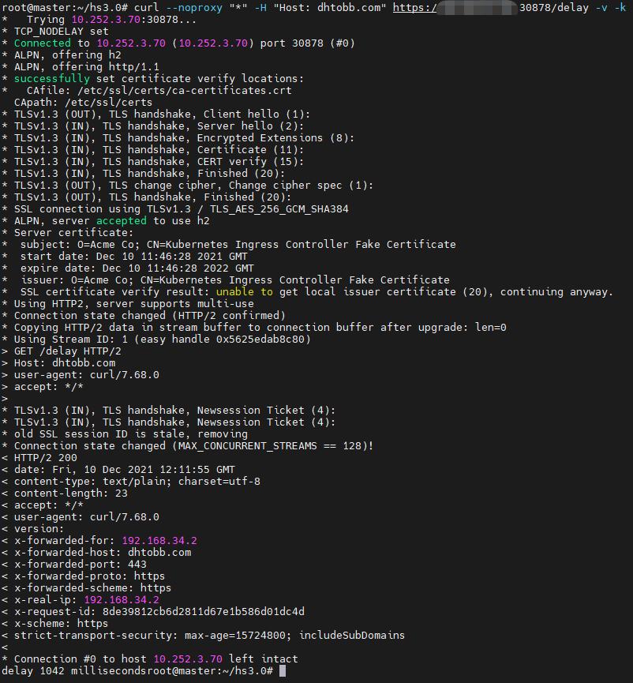
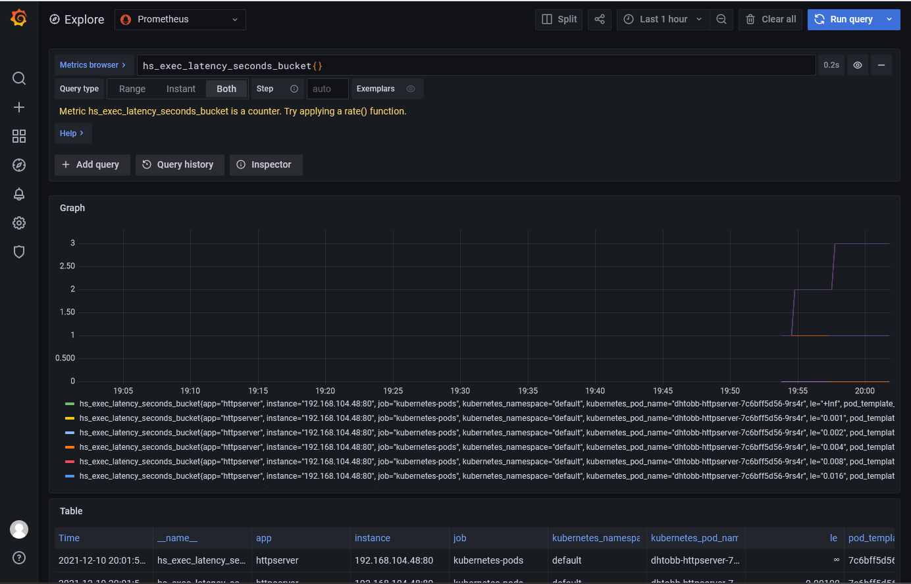
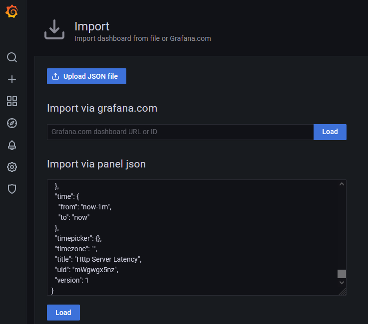
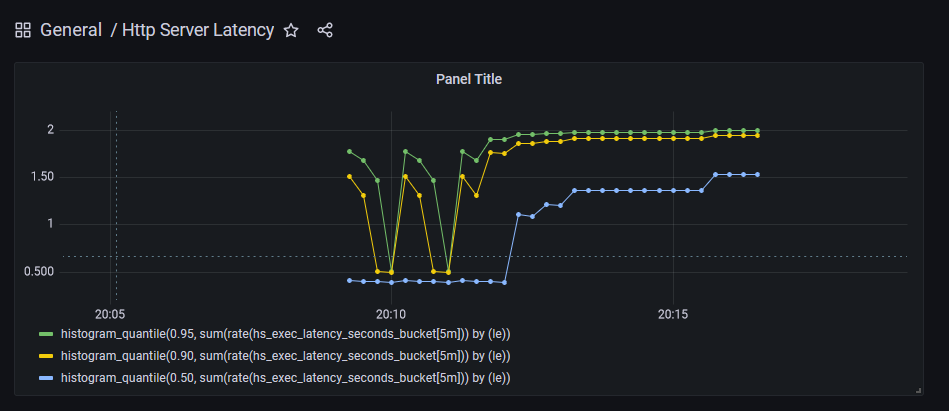

## 1212模块十作业要求：

---
- 为HTTPServer 添加 0-2 秒的随机延时
- 为HTTPServer 项目添加 延时Metric
- 将HTTPServer 部署至测试集群，并完成 Prometheus 配置
- 从Promethus 界面中查询延时指标数据
- （可选）创建一个 Grafana Dashboard 展现延时分配情况

## 操作步骤

---
1. 打包编译镜像
```shell
make push
```

> https://hub.docker.com/repository/docker/dhtobb/httpserver
> dhtobb/httpserver:v3.0
> 
> 新增了prometheus指标支持

2. 安装部署集群
```shell
make deployment

make clean #清理部署
```

3. 为集群安装grafana与prometheus
>见下方详情说明

## 详情说明

---
- 为HTTPServer 添加 0-2 秒的随机延时
```go
rand.Seed(time.Now().UnixNano())
delay := randInt(0, 2000)

time.Sleep(time.Millisecond * time.Duration(delay))
```

- 为HTTPServer 项目添加 延时Metric
```go
//1.应用启动时，注册metrics路由
mux.Handle("/metrics", promhttp.Handler())

//2.注册metrics， metrics/metrics.go
metrics.Register()

//3. 代码中输出指标
timer := metrics.NewTimer()
defer timer.ObserveTotal()
```

- 将HTTPServer 部署至测试集群，并完成 Prometheus 配置
> deployment时声明上报指标端口和地址
```yaml
  template:
    metadata:
      annotations:
        prometheus.io/scrape: "true" #允许k8s扫描prometheus
        prometheus.io/port: "80"
      labels:
        app: httpserver
```

- 从Promethus 界面中查询延时指标数据
> grafana官网地址： https://artifacthub.io/packages/search?repo=grafana
> loki github地址： https://github.com/grafana/loki/releases/tag/v2.4.1

1. 安装grafana、loki以及prometheus
> loki以及prometheus为同一家公司产品，可以一并安装
```shell
#增加grafana源，并更新
helm repo add grafana https://grafana.github.io/helm-charts
helm repo update

#安装出错，需要修改版本
root@master:~/ll# helm upgrade --install loki grafana/loki-stack --set grafana.enabled=true,prometheus.enabled=true,prometheus.alertmanager.persistentVolume.enabled=false,prometheus.server.persistentVolume.enabled=false
Release "loki" does not exist. Installing it now.
Error: unable to build kubernetes objects from release manifest: [unable to recognize "": no matches for kind "ClusterRole" in version "rbac.authorization.k8s.io/v1beta1", unable to recognize "": no matches for kind "ClusterRoleBinding" in version "rbac.authorization.k8s.io/v1beta1"]

#解决方法
helm pull grafana/loki-stack 
tar -xvf loki-stack-2.5.0.tgz
cd loki-stack/

#替换所有的 rbac.authorization.k8s.io/v1beta1 为 rbac.authorization.k8s.io/v1
sed -i "s#rbac.authorization.k8s.io/v1beta1#rbac.authorization.k8s.io/v1#g" `grep -rl "rbac.authorization.k8s.io/v1beta1" ./`

#从本地目录安装
helm upgrade --install loki ./loki-stack --set grafana.enabled=true,prometheus.enabled=true,prometheus.alertmanager.persistentVolume.enabled=false,prometheus.server.persistentVolume.enabled=false
```

2. 更改grafana service类型为NodePort并访问
```shell
#查看对应的service
root@master:~/ll# kubectl get svc -owide
NAME                            TYPE        CLUSTER-IP       EXTERNAL-IP   PORT(S)           AGE   SELECTOR
loki                            ClusterIP   10.102.129.57    <none>        3100/TCP          10m   app=loki,release=loki
loki-grafana                    ClusterIP   10.104.171.57    <none>        80/TCP            10m   app.kubernetes.io/instance=loki,app.kubernetes.io/name=grafana
loki-headless                   ClusterIP   None             <none>        3100/TCP          10m   app=loki,release=loki
loki-kube-state-metrics         ClusterIP   10.111.251.49    <none>        8080/TCP          10m   app.kubernetes.io/instance=loki,app.kubernetes.io/name=kube-state-metrics
loki-prometheus-alertmanager    ClusterIP   10.97.212.170    <none>        80/TCP            10m   app=prometheus,component=alertmanager,release=loki
loki-prometheus-node-exporter   ClusterIP   None             <none>        9100/TCP          10m   app=prometheus,component=node-exporter,release=loki
loki-prometheus-pushgateway     ClusterIP   10.99.33.68      <none>        9091/TCP          10m   app=prometheus,component=pushgateway,release=loki
loki-prometheus-server          ClusterIP   10.105.100.212   <none>        80/TCP            10m   app=prometheus,component=server,release=loki

#更改loki-grafana的类型为ClusterIP为NodePort
root@master:~/ll# kubectl get svc -owide
NAME                            TYPE        CLUSTER-IP       EXTERNAL-IP   PORT(S)           AGE   SELECTOR
loki-grafana                    NodePort    10.104.171.57    <none>        80:31278/TCP      13m   app.kubernetes.io/instance=loki,app.kubernetes.io/name=grafana
#通过宿主机的 31278 端口即可访问
```

3. 查看登录的用户名和密码
```shell
root@master:~/ll# kubectl get secret loki-grafana -oyaml
apiVersion: v1
data:
  admin-password: Y2I2eHozRnRWeHdoVXlGZFZwb2ZJUXdjdmFQa3hoaG1EM3g4alhvZQ==
  admin-user: YWRtaW4=
  ldap-toml: ""
kind: Secret
metadata:
  annotations:
    meta.helm.sh/release-name: loki
    meta.helm.sh/release-namespace: default
  creationTimestamp: "2021-12-10T11:19:40Z"
  labels:
    app.kubernetes.io/instance: loki
    app.kubernetes.io/managed-by: Helm
    app.kubernetes.io/name: grafana
    app.kubernetes.io/version: 8.1.6
    helm.sh/chart: grafana-6.16.12
  name: loki-grafana
  namespace: default
  resourceVersion: "723336"
  uid: dd15f3ef-71c5-4b89-a119-8edb3461e7a8
type: Opaque

#解码用户名
root@master:~/ll# echo YWRtaW4= | base64 -d
admin 

#解码密码
root@master:~/ll# echo Y2I2eHozRnRWeHdoVXlGZFZwb2ZJUXdjdmFQa3hoaG1EM3g4alhvZQ== | base64 -d
cb6xz3FtVxwhUyFdVpofIQwcvaPkxhhmD3x8jXoe
```

4. 手动先访问几次url，用以生成指标
```shell
root@master:~/hs3.0# kubectl get svc -n ingress-nginx
NAME                                 TYPE        CLUSTER-IP       EXTERNAL-IP   PORT(S)                      AGE
ingress-nginx-controller             NodePort    10.96.187.149    <none>        80:32144/TCP,443:30878/TCP   23m

```
> curl --noproxy "*" -H "Host: dhtobb.com" https://HOST-IP:30878/delay -v -k
> 


6. 在grafana中查看数据源prometheus的数据
> Explore -> Prometheus -> 选择指标（如：hs_exec_latency_seconds_bucket{}）



- （可选）创建一个 Grafana Dashboard 展现延时分配情况
> Dashboards -> Manage -> Import
> 将dashboard目录下的 httpserver-latency.json 内容粘贴进去导入


>查看最近15分钟的记录
