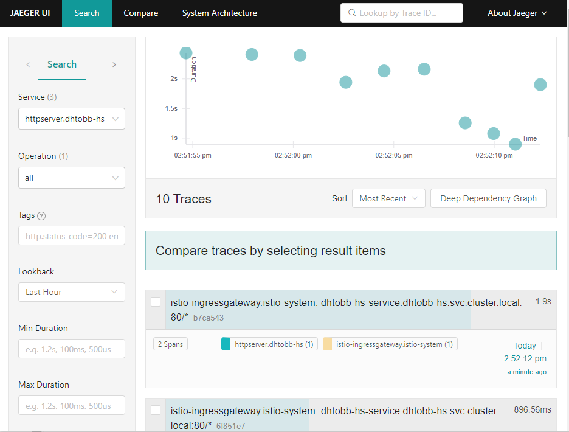
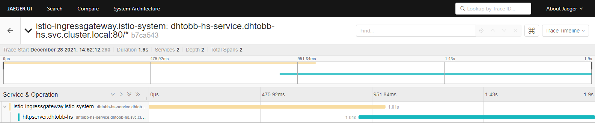

## 1226模块十二作业要求：

---
把 httpserver 服务以 Istio Ingress Gateway 的形式发布出来。以下是你需要考虑的几点：

- 如何实现安全保证；
- 七层路由规则；
- 考虑 open tracing 的接入。

## 操作步骤

---
1. 打包编译镜像
```shell
make push
```

> https://hub.docker.com/repository/docker/dhtobb/httpserver
> 
> dhtobb/httpserver:v4.0
> 


2. 安装部署集群
```shell
#部署
make deployment

#清理部署
make clean 
```

3. 访问
```shell
root@master:~/hw_05# k get svc -nistio-system
NAME                   TYPE           CLUSTER-IP                EXTERNAL-IP   PORT(S)                                                                      AGE
istio-ingressgateway   LoadBalancer   GATEWAY_IP(XX.XX.XX.XX)   <pending>     15021:30116/TCP,80:30703/TCP,443:30372/TCP,31400:31526/TCP,15443:30252/TCP   145m

#通过http访问
curl --noproxy "*" -H "Host: hs.dhtobb.io"  ${GATEWAY_IP}/delay -v

#通过https访问
curl --noproxy "*"  --resolve hss.dhtobb.io:443:${GATEWAY_IP}  https://hss.dhtobb.io/delay  -k -v
```

## 详情步骤说明

- 单独部署envoy进行测试
```shell
#将httpserver的deployment以及service部署好之后，部署envoy
kubectl create configmap envoy-config --from-file=spec/envoy.yaml
kubectl create -f spec/envoy-deploy.yaml 

root@master:~/hw_05# kubectl get pod -owide
NAME                                 READY   STATUS    RESTARTS   AGE   IP               NODE     NOMINATED NODE   READINESS GATES
dhtobb-httpserver-7c6bff5d56-fbczx   1/1     Running   0          73s   192.168.219.67   master   <none>           <none>
dhtobb-httpserver-7c6bff5d56-xrhpk   1/1     Running   0          73s   192.168.104.4    node2    <none>           <none>
envoy-fb5d77cc9-r4g7m                1/1     Running   0          72s   192.168.135.6    node3    <none>           <none>

#目前没有使用ssh， 通过curl访问envoy监听的10000端口，即可成功访问,与直接访问httpserver的pod，以及service效果相同
#envoy将访问请求转到了 dhtobb-httpserver-service
root@master:~/hw_05# curl --noproxy "*" -H "Host: hs.dhtobb.com" http://192.168.135.6:10000/delay -v -k
*   Trying 192.168.135.6:10000...

< server: envoy
<
* Connection #0 to host 192.168.135.6 left intact
delay 392 milliseconds
```

---
- 安装istio
>  下载地址: https://github.com/istio/istio/releases/tag/1.12.1
```shell
- 添加istioctl到PATH路径
vi ~/.bash_profile
source ~/.bash_profile

- 添加istio的自动补全脚本
cp tools/istioctl.bash ~/.istioctl.bash
source ~/.istioctl.bash

- 查看istio的版本号
istioctl version --remote=false

- 安装install -- 确保网络插件 cni 正常安装
istioctl install --set profile=demo -y

- 查看安装情况
root@master:~/istio-1.12.1# kubectl get svc -n istio-system
NAME                   TYPE           CLUSTER-IP       EXTERNAL-IP   PORT(S)                                                                      AGE
istio-egressgateway    ClusterIP      10.110.155.45    <none>        80/TCP,443/TCP                                                               33m
istio-ingressgateway   LoadBalancer   10.103.115.171   <pending>     15021:30116/TCP,80:30703/TCP,443:30372/TCP,31400:31526/TCP,15443:30252/TCP   33m
istiod                 ClusterIP      10.106.177.229   <none>        15010/TCP,15012/TCP,443/TCP,15014/TCP                                        38m


- 卸载istio
istioctl manifest generate --set profile=demo | kubectl delete -f -
```


- istio部署到集群
> 定义别名，方便操作： alias ki='kubectl -n istio-system'
```shell
root@master:~/hw_05# ki get pod
NAME                                    READY   STATUS    RESTARTS   AGE
istio-egressgateway-687f4db598-nrxmt    1/1     Running   0          81m
istio-ingressgateway-78f69bd5db-wnspm   1/1     Running   0          81m
istiod-76d66d9876-xldtb                 1/1     Running   0          86m
```

```shell
#将httpserver的deployment以及service部署好之后，部署istio相关配置
kubectl apply -f specs/istio-specs.yaml -n dhtobb-hs 

root@master:~/hw_05# k get svc -nistio-system
NAME                   TYPE           CLUSTER-IP       EXTERNAL-IP   PORT(S)                                                                      AGE
istio-egressgateway    ClusterIP      10.110.155.45    <none>        80/TCP,443/TCP                                                               145m
istio-ingressgateway   LoadBalancer   10.103.115.171   <pending>     15021:30116/TCP,80:30703/TCP,443:30372/TCP,31400:31526/TCP,15443:30252/TCP   145m
istiod                 ClusterIP      10.106.177.229   <none>        15010/TCP,15012/TCP,443/TCP,15014/TCP                                        150m

#访问
root@master:~/hw_05# curl --noproxy "*" -H "Host: hs.dhtobb.io"  10.103.115.171/delay -v
*   Trying 10.103.115.171:80...
* Connected to 10.103.115.171 (10.103.115.171) port 80 (#0)

< server: istio-envoy
<
* Connection #0 to host 10.103.115.171 left intact
delay 1825 millisecondsr


```

- 七层路由规则
```yaml
    - match:
        - uri:
            exact: "/not-delay"
      rewrite:
        uri: "/delay"
      route:
          - destination:
              host: dhtobb-httpserver-service
              port:
                number: 80
```
```shell
#访问/not-delay时将被重新定向到/delay
root@master:~/hw_05# curl --noproxy "*" -H "Host: hs.dhtobb.io"  10.103.115.171/not-delay -v
*   Trying 10.103.115.171:80...
* TCP_NODELAY set
* Connected to 10.103.115.171 (10.103.115.171) port 80 (#0)
> GET /not-delay HTTP/1.1
...
< server: istio-envoy
<
* Connection #0 to host 10.103.115.171 left intact
delay 1148 millisecondsr
```

- 如何实现安全保证；
```yaml
apiVersion: networking.istio.io/v1beta1
kind: VirtualService
    - match:
        - port: 443
      route:
        - destination:
            host: dhtobb-httpserver-service
            port:
              number: 80

---
apiVersion: networking.istio.io/v1beta1
kind: Gateway # 对应 listener, 使istio增加对80端口的监听器， 然后根据VirtualService的规则做转发
    - hosts:
        - http.dhtobb.io
      port:
        name: https-dhtobb-port
        number: 443
        protocol: HTTPS
      tls:
        mode: SIMPLE #单向认证
        credentialName: dhtobb-credential 
```
```shell
#通过https访问
root@master:~/hw_05# curl --noproxy "*"  --resolve hss.dhtobb.io:443:10.103.115.171  https://hss.dhtobb.io/delay  -k -v
*   Trying 10.103.115.171:80...
* TCP_NODELAY set
* Connected to 10.103.115.171 (10.103.115.171) port 80 (#0)
> GET /not-delay HTTP/1.1
...
< server: istio-envoy
<
* Connection #0 to host 10.103.115.171 left intact
delay 1148 millisecondsr
```

- 考虑 open tracing 的接入。
> 注意： 
> 
> 1.golang中向下发送header时需要转换小写，否则首字母大写导致tracing失效
> 
> 2.tracing需要依赖sidecar
```shell
# 需要安装istio的tracing插件 jaeger
root@master:~/hw_05# kubectl apply -f specs/jaeger.yaml
deployment.apps/jaeger created
service/tracing created
service/zipkin created
service/jaeger-collector created

 root@master:~/hw_05# ki get pod
NAME                                    READY   STATUS    RESTARTS       AGE
jaeger-5d44bc5c5d-8hgxk                 1/1     Running   0              32s

# 查看面板
istioctl dashboard jaeger --address=IPADDR --browser=false
```



## 遇到问题
1. 启用自动注入sidecar，deployment失败
>问题描述
> 
>message: 'Internal error occurred: failed calling webhook "namespace.sidecar-injector.istio.io":
failed to call webhook: Post "https://istiod.istio-system.svc:443/inject?timeout=10s":
Service Unavailable'
>
```shell
###解决方法：
# 自动注入错误尚未解决？？？？

# 手动注入规避
kubectl get namespace -L istio-injection #查看标签情况
kubectl label ns dhtobb-hs istio-injection- #移除命名空间的istio-injection标签
istioctl kube-inject -f specs/deployment.yaml -o  specs/deployment.istio.injected.yaml

# 自动注入的优先级
# 1.Pod 注解（优先级最高，如 Pod 中含注解 sidecar.istio.io/inject: "true/false"，则会被优先处理） 
# 2.neverInjectSelector  (ConfigMap istio-sidecar-injector)
# 3.alwaysInjectSelector (ConfigMap istio-sidecar-injector)
# 4.命名空间策略。
# 1 > 2 > 3 > 4
```

## istio常用排查问题命令
1. 使用istioctl analyzer 分析集群istio可能存在的问题
```shell
istioctl analyze -n dhtobb-hs
```

2. 检查secret是否被正确加载
```shell
root@master:~/hw_05# ki get pod
NAME                                    READY   STATUS    RESTARTS     AGE
istio-egressgateway-687f4db598-nrxmt    1/1     Running   2 (8h ago)   27h
istio-ingressgateway-78f69bd5db-wnspm   1/1     Running   2 (8h ago)   27h
istiod-76d66d9876-xldtb                 1/1     Running   1 (8h ago)   27h
root@master:~/hw_05# istioctl proxy-config secret istio-ingressgateway-78f69bd5db-wnspm.istio-system
RESOURCE NAME                      TYPE           STATUS     VALID CERT     SERIAL NUMBER                                        NOT AFTER                NOT BEFORE
default                            Cert Chain     ACTIVE     true           258722462743374367991866954370940874449              2021-12-28T01:19:44Z     2021-12-27T01:17:44Z
kubernetes://dhtobb-credential     CA             ACTIVE     true           670924312348546279233026568127787619702559926885     2022-12-27T09:43:14Z     2021-12-27T09:43:14Z
ROOTCA                             CA             ACTIVE     true           214708866405252202843882824997057289667              2031-12-24T06:45:40Z     2021-12-26T06:45:40Z

```

3. 检查ingress网关日志
> istioctl proxy-config log {ingress-pod}.istio-system 
> istioctl dashboard envoy {ingress-pod}.istio-system